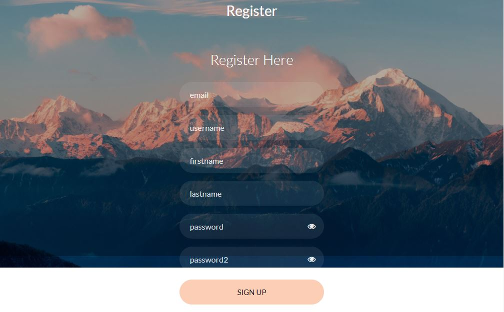

# Project Title

This is a FastAPI based web application that is used to store all your projects.

## Getting Started

These instructions will get you a copy of the project up and running on your local machine for development and testing purposes. See deployment for notes on how to deploy the project on a live system.

### Prerequisites

Make sure you have the following prerequisites installed:
- MySQL [Windows](https://dev.mysql.com/downloads/windows/installer/8.0.html)


### Installing

#### 1. Environment setup.
```commandline
conda create --prefix ./env python=3.7 -y
conda activate ./env
```

#### 2. Install Requirements
```commandline
pip install -r requirements.txt
```

#### 3. Run the setup
```commandline
pip install -e .
```

## Run Application

#### 1. Pull Docker image of mysql
Put password in "your password"
```commandline
docker run -d -e MYSQL_ROOT_PASSWORD="your password" -p 3306:3306 mysql
```

#### 2. Put the passoword in .env file
```commandline
DATABASE_KEY=-Bx1wYj3YO2NQind7778-Ta2NBPMalo64dNsFRjuSYY=
SECRET_KEY=KlgH6AzYDeZeGwD288to79I3vTHT8wp7
ALGORITHM=HS256
MYSQL_ROOT_PASSWORD="your password"
```
#### 3. Install MySQL workbench and connect with the database

#### 4 Run the app.py
```commandline
python app.py
```
#### 5 Open application
```commandline
http://127.0.0.1:8000
```

## Run using Docker Compose
- Add MYSQL_ROOT_PASSWORD in the .env file
- You can also change the "MYSQL_DATABASE".
```commandline

version: '3'
services:
  db:
    image: mysql:latest
    environment:
      MYSQL_DATABASE: ${MYSQL_DATABASE}
      # MYSQL_USER: admin
      # MYSQL_PASSWORD: hellodb123
      MYSQL_ROOT_PASSWORD: ${MYSQL_ROOT_PASSWORD}
    ports:
      - 3306:3306
    expose:
      - '3306'

    volumes:
      - D:\vol\mysql_data:/var/lib/mysql
      - D:\vol\mysql_d:/var/run/mysqld

  app:
    build: .
    command: python app.py
    ports:
     - 8080:8000
    volumes:
     - D:\vol\mysql_d:/var/run/mysqld   
    depends_on:
      - db
```

#### Docker compose UP
```commandline
docker compose up -d
```
#### Open application
```commandline
http://127.0.0.1:8080
```
## Interface

Login page


Register Page


Home Page


View App Page


Add App Page


## Built With

* [FastAPI](https://fastapi.tiangolo.com/) - The web framework used
* [MySQL](https://dev.mysql.com/downloads/windows/) - Database

## Authors

* **iNeuron Private Limited** - *Initial work* - [iNeuron-Pvt-Ltd](https://github.com/iNeuron-Pvt-Ltd)


## License

This project is licensed under the MIT License - see the [LICENSE.md](LICENSE.md) file for details


